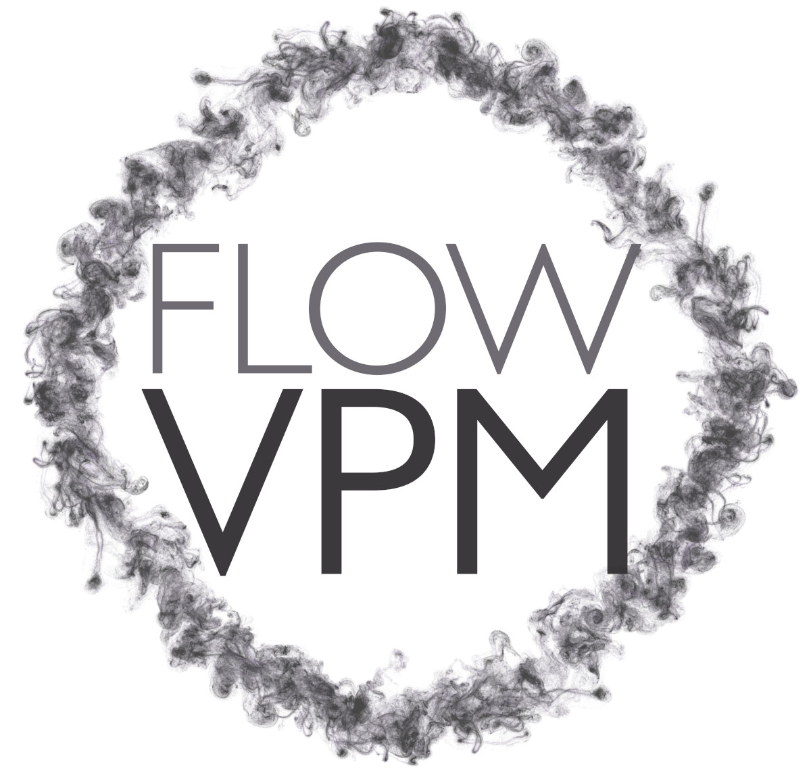

Three-dimensional viscous vortex particle code in Julia 1.4.2.

## Features
  * Fast-multipole acceleration through ExaFMM.
  * Single-node CPU parallel processing through OpenMPI.
  * Viscous diffusion through either core spreading or particle-strength exchange scheme.

## Folders
  * `src`         : Source code.

## Resources
  * Theory and numerical method explained: [Paper](https://github.com/byuflowlab/SimpleVPM.jl/blob/master/docs/Theory.pdf), [Video](https://www.youtube.com/watch?v=24sxy_hTJ9s), [Implementation](https://github.com/byuflowlab/SimpleVPM.jl)
  * Recommendations for rotor simulations and numerical stability: [Paper](http://flowlab.groups.et.byu.net/preprints/Alvarez2020.pdf)

## Authorship & Copyright
* Author            : Eduardo J Alvarez
* Created           : 2019
* Email             : Edo.AlvarezR@gmail.com
* Website           : [edoalvarez.com](https://www.edoalvarez.com/)
* Copyright         : Copyrighted to Eduardo J. Alvarez and the FLOW Lab. All
    rights reserved. No licensing, use, or modification of this code is allowed
    without written consent.

