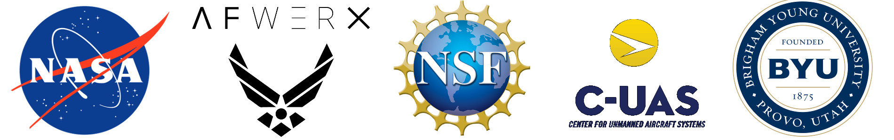
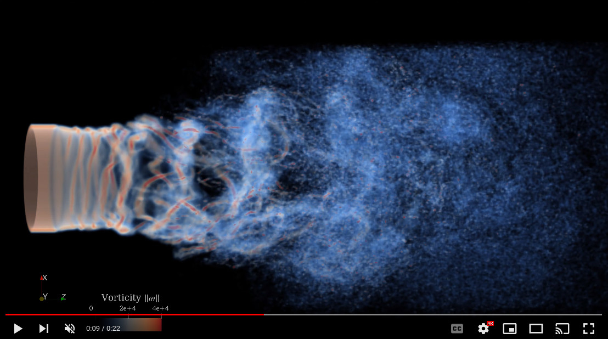
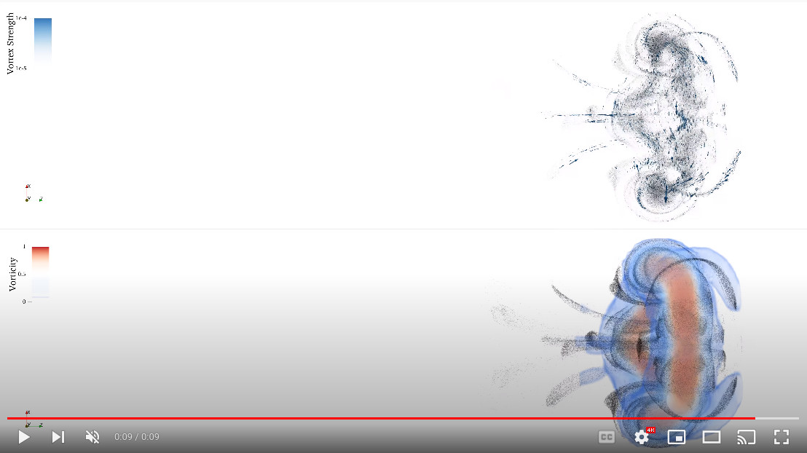
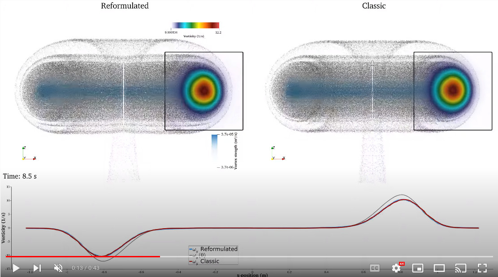
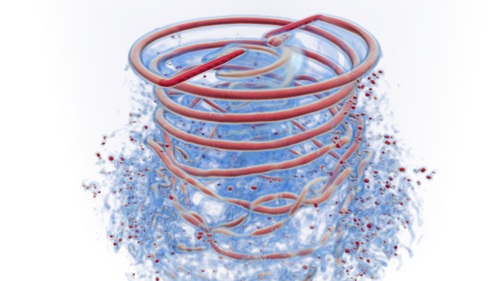
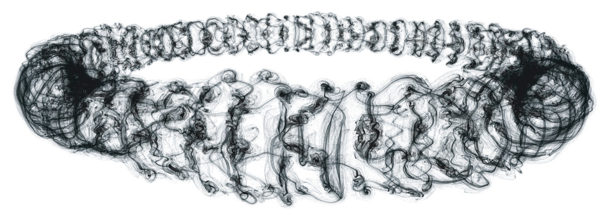
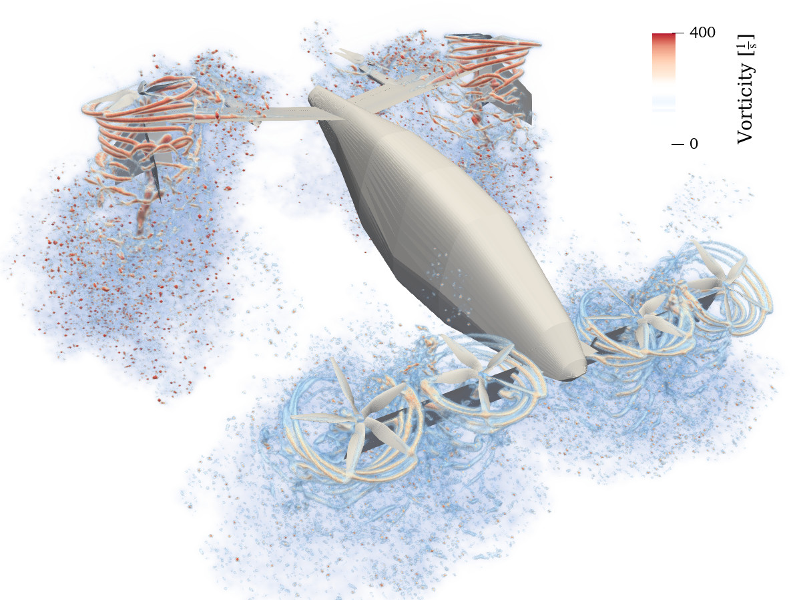

# FLOWVPM.jl
FLOWVPM implements the reformulated vortex particle method (rVPM) developed in E. J. Alvarez' doctoral dissertation *Reformulated Vortex Particle Method and Meshless Large Eddy Simulation of Multirotor Aircraft*, 2022 [[PDF]](https://scholarsarchive.byu.edu/cgi/viewcontent.cgi?article=10598&context=etd)[[VIDEO]](https://www.nas.nasa.gov/pubs/ams/2022/08-09-22.html).
The rVPM is a meshless CFD method solving the LES-filtered incompressible Navier-Stokes equations in their vorticity form.
It uses a Lagrangian scheme, which not only avoids the hurdles of mesh generation, but it also conserves vortical structures over long distances with minimal numerical dissipation while being orders of magnitude faster than conventional mesh-based CFD.

The rVPM uses particles to discretize the Navier-Stokes equations, with the particles representing radial basis functions that construct a continuous vorticity/velocity field.
The basis functions become the LES filter, providing a variable filter width and spatial adaption as the particles are convected and stretched by the velocity field.
The local evolution of the filter width provides an extra degree of freedom to re-inforce conservations laws, which makes the reformulated VPM numerically stable.

This meshless CFD has several advantages over conventional mesh-based CFD.
In the absence of a mesh, the rVPM (1) does not suffer from the conventional CFL condition, (2) does not suffer from the numerical dissipation introduced by a mesh, and (3) derivatives are calculated analytically rather than approximated through a stencil.
Furthermore, rVPM is highly efficient since it uses computational elements only where there is vorticity rather than meshing the entire space, making it 100x faster than conventional mesh-based LES.

FLOWVPM is implemented in Julia, which is a modern, high-level, dynamic programming language for high-performance computing.
[Paraview](https://www.paraview.org/) is recommended for visualization of simulations.

## Installation

Install using Julia's package manager as:

```@julia-repl
] add https://github.com/byuflowlab/FLOWVPM.jl.git
```

## Features
  * Fast-multipole acceleration through FastMultipole.jl
  * Threaded CPU parallelization through OpenMP
  * Meshless
  * Second-order spatial accuracy and third-order RK time integration
  * Numerically stable by reshaping particles subject to vortex stretching
  * Subfilter-scale (SFS) model of turbulence associated to vortex stretching
  * SFS model coefficient computed dynamically or prescribed
  * Viscous diffusion through core spreading

  FLOWVPM is a stand-alone simulation framework, but it has also been integrated and used in the following codes: [FLOWUnsteady](https://github.com/byuflowlab/FLOWUnsteady) and
  [VortexLattice](https://github.com/byuflowlab/VortexLattice)

  This is an open-source project.
  Improvements and further development by the community are accepted and encouraged.

## Theory and Validation
  * E. J. Alvarez, 2022, *Reformulated Vortex Particle Method and Meshless Large Eddy Simulation of Multirotor Aircraft*. Doctoral Dissertation, Brigham Young University. [[PDF]](https://scholarsarchive.byu.edu/etd/9589/)[[VIDEO]](https://www.nas.nasa.gov/pubs/ams/2022/08-09-22.html)
  * E. J. Alvarez & A. Ning, 2022, *Reviving the Vortex Particle Method: A Stable Formulation for Meshless Large Eddy Simulation*. In review. [[PDF]](https://arxiv.org/abs/2206.03658)
  * E. J. Alvarez, J. Mehr, & A. Ning, 2022, *FLOWUnsteady: An Interactional Aerodynamics Solver for Multirotor Aircraft and Wind Energy*. AIAA AVIATION 2022 Forum. [[PDF]](https://scholarsarchive.byu.edu/facpub/5830/)

## Sponsors
  

## Examples

  **Turbulent Jet:** [`examples/roundjet/`](https://github.com/byuflowlab/FLOWVPM.jl/tree/master/examples/roundjet) [[VIDEO1](https://www.youtube.com/watch?v=SobMmRR9JlU)] [[VIDEO2](https://www.youtube.com/watch?v=V9hthE7m1d4)]
  [](https://www.youtube.com/watch?v=V9hthE7m1d4)

  **Vortex Ring Leapfrog:** [`examples/vortexrings/`](https://github.com/byuflowlab/FLOWVPM.jl/tree/master/examples/vortexrings)
  [](https://www.youtube.com/watch?v=viE-i0KzVOw)

  **Isolated Vortex Ring:** [`examples/vortexrings/`](https://github.com/byuflowlab/FLOWVPM.jl/tree/master/examples/vortexrings)
  [](https://www.youtube.com/watch?v=PaR81mmByL8)

  **Rotor in Hover:** [FLOWUnsteady](https://github.com/byuflowlab/FLOWUnsteady) [[VIDEO](https://www.youtube.com/watch?v=u9SgYbYhPpU)]
  [](https://www.youtube.com/watch?v=u9SgYbYhPpU)

  **Ring with Toroidal Vorticity:** [[LINK](https://www.linkedin.com/posts/alvarezedo_cfd-paraview-fluiddynamics-activity-6857078379137650688-F0yO)] [[VIDEO](https://www.youtube.com/watch?v=D3VHhDR8-bI)]
  [](https://www.youtube.com/watch?v=D3VHhDR8-bI)

  **eVTOL Aircraft:** [FLOWUnsteady](https://github.com/byuflowlab/FLOWUnsteady)  [[VIDEO](https://youtu.be/-6aR37Z6hig)]
  [](https://youtu.be/-6aR37Z6hig)

## About
  * Main Developer    : Eduardo J Alvarez
  * Email             : Edo.AlvarezR@gmail.com
  * Website           : [edoalvarez.com](https://www.edoalvarez.com/)
  * Created           : 2019
  * License           : MIT
